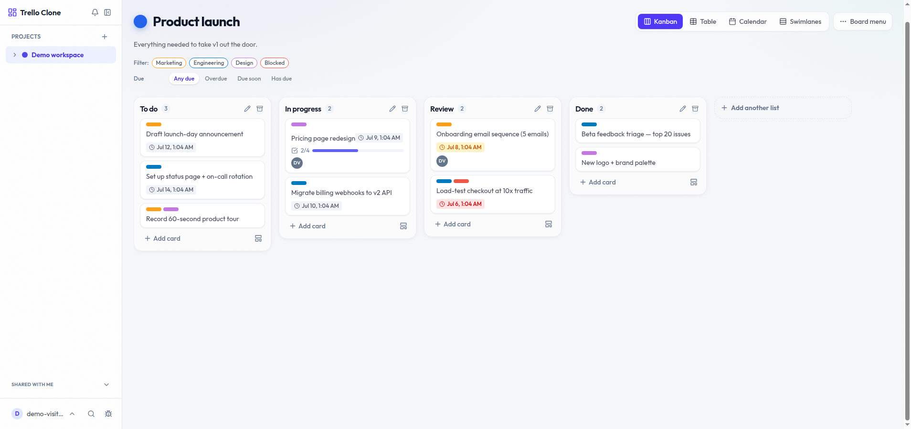

# trello clone — kanban app with production-grade observability

A full kanban board (boards → lists → cards) built to practice running a real service in
production: every request is traced, metered, and logged, and the ops tooling ships with the
app itself.

**Live:** [trello-clone.shop](https://trello-clone.shop) · Built by
[Long Nguyen](https://github.com/nsnl-coder) — see also [fxdrill](https://github.com/nsnl-coder/fxdrill),
my flagship project.

**Try it — one click, no sign-up:** [app.trello-clone.shop/api/auth/demo](https://app.trello-clone.shop/api/auth/demo)
drops you onto a pre-seeded board with a throwaway demo account (swept automatically after 7 days).



## Features

- Drag-and-drop boards, lists, and cards (dnd-kit) with Markdown card descriptions
- Type-safe end to end: tRPC 11 API over Kysely/PostgreSQL, shared Zod schemas
- File/image upload to MinIO object storage; Redis (ioredis) caching
- REST + Swagger docs generated from the tRPC routers (`trpc-to-openapi`)

## Observability (the point of this project)

- **OpenTelemetry** auto-instrumentation: OTLP traces + Prometheus metrics exporters
- **Grafana** dashboards, **Loki** logs (structured pino), **Sentry** error tracking
- SSO-gated admin subdomains for Grafana, MinIO console, and ops tools — one login guards
  the whole operations surface
- Dockerized deployment (nginx, Postgres, Redis, MinIO) across dev/prod VPS tiers

## Monorepo layout

```
packages/backend    Express + tRPC API, Kysely migrations, OTel setup
packages/frontend   React + Vite SPA (dnd-kit, TanStack Query)
packages/landing    marketing page
packages/shared     Zod schemas & types shared across packages
packages/infra      Dockerfiles, compose, nginx, grafana/loki config
```
